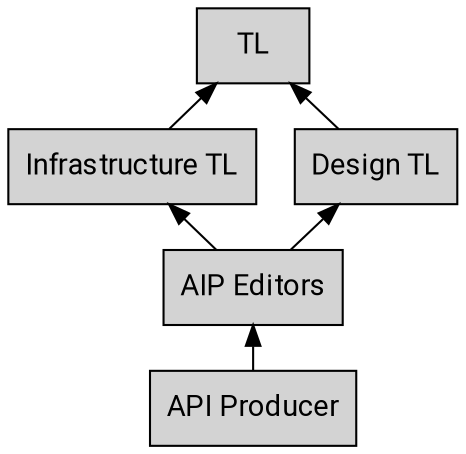
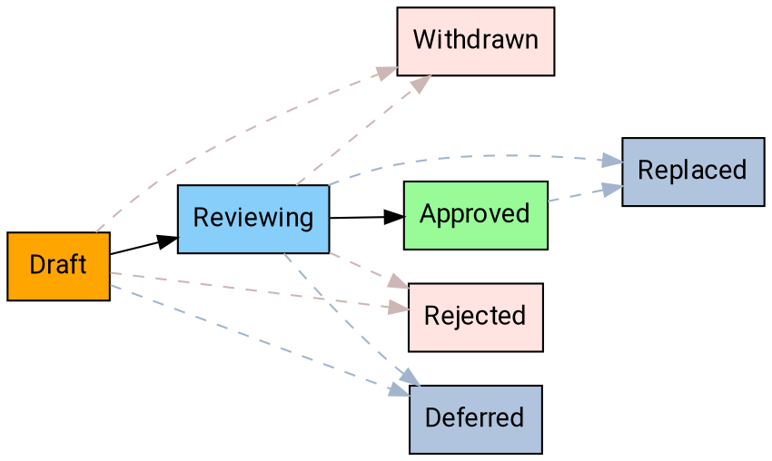

# AIP Purpose and Guidelines

As the corpus of Google APIs has grown and the API Governance team has grown to
meet the demand of supporting them, it is increasingly necessary to have a
corpus of documentation for API producers, reviewers, and other interested
parties to reference. The API style guide and introductory One Platform
documentation are intentionally terse and high-level. The AIP collection
provides a way to provide consistent documentation for API design guidance.

随着 Google API 语料库的增长以及 API Governance 团队的成长以满足支持它们的需求，越来越有必要为 API 生产者、审阅者和其他相关方提供文档库以供参考。 API 风格指南和介绍性 One Platform 文档有意简洁和高级。 AIP 集合提供了一种为 API 设计指南提供一致文档的方法。

## What is an AIP?

AIP stands for **API Improvement Proposal**, which is a design document
providing high-level, concise documentation for API development. They are to
serve as the source of truth for API-related documentation at Google and the
means by which API teams discuss and come to consensus on API guidance. AIPs
are maintained as Markdown files in the [AIP GitHub repository][].

AIP 代表 API Improvement Proposal，它是一个设计文档，为 API 开发提供高级、简洁的文档。 它们将作为 Google API 相关文档的真实来源，以及 API 团队讨论并就 API 指南达成共识的方式。 AIP 在 AIP GitHub 存储库中作为 Markdown 文件进行维护。

## Types of AIPs

There are several different types of AIPs, described below. The list of AIP
types may evolve over time as necessary.

有几种不同类型的 AIP，如下所述。 AIP 类型列表可能会随着时间的推移而变化。

### Guidance

These AIPs describe guidance on API design. These are provided as instruction
for API producers to help write simple, intuitive, and consistent APIs, and are
used by API reviewers as a basis for review comments.

这些 AIP 描述了 API 设计指南。 这些是为 API 生产者提供的指导，以帮助编写简单、直观和一致的 API，并被 API 审阅者用作审阅评论的基础。

### Process

These AIPs describe a process surrounding API design. They often affect the AIP
process itself and are used to enhance the way in which AIPs are handled.

这些 AIP 描述了围绕 API 设计的过程。 它们通常会影响 AIP 流程本身，并用于增强处理 AIP 的方式。

## Stakeholders 利益相关者

As with any process there are many different stakeholders when it comes to
reviewing and working with AIPs. Below is a summary of the escalation path
starting with the API producer.

与任何流程一样，涉及到许多不同的利益相关者
审查和使用 AIP。 以下是升级路径的摘要
从 API 生产者开始。

### Technical leads

The current TL (technical lead) for APIs is Eric Brewer; he has delegated some
responsibilities for API Infrastructure to Hong Zhang ([@wora][]) and API
Design to JJ Geewax ([@jgeewax][]).

As noted in the diagram above, the TL is the final decision-maker on the AIP
process and the final point of escalation if necessary.

### Editors

The editors are the set of people who make decisions on AIPs. The general goal
is that the AIP process is collaborative and that we largely work on the basis
of consensus. However, a limited number of designated approvers is necessary,
and these Googlers will be approvers for each AIP in the general scope.

The list of AIP editors is currently:

- Hong Zhang ([@wora][])
- JJ Geewax ([@jgeewax][])
- Jon Skeet ([@jskeet][])
- Sam Woodard ([@shwoodard][])

The editors are also responsible for the administrative and editorial aspects
of shepherding AIPs and managing the AIP pipeline and workflow. They approve
PRs to AIPs, assign proposal numbers, manage the agenda, set AIP states, and so
forth. They also ensure that AIPs are readable (proper spelling, grammar,
sentence structure, markup, etc.).

AIP editorship is by invitation of the current editors.

## Domain-specific AIPs 特定于域的 AIP

Some AIPs may be specific to a particular domain (for example, only to APIs
within a certain PA, or even a certain team). In this situation, the group will
be given a particular block of AIPs to use in accordance with AIP-2, and the
applicable AIPs will clearly indicate their scope.

某些 AIP 可能特定于特定域（例如，仅适用于 API
在某个 PA，甚至某个团队内）。 在这种情况下，小组将
根据 AIP-2 给予特定的 AIP 块以供使用，并且
适用的 AIP 将清楚地表明其范围。

## States

At any given time, AIPs may exist in a variety of states as they work their way
through the process. The following is a summary of each state.

在任何给定时间，AIP 可能存在于各种状态，因为它们按自己的方式工作
通过这个过程。 以下是每个状态的摘要。

### Draft 草案

The initial state for an AIP is the "Draft" state. This means that the AIP is
being discussed and iterated upon, primarily by the original authors. While the
editors _may_ get involved at this stage, it is not necessary.

**Note:** If significant, high-level iteration is required, it is recommended
to draft AIPs in a Google doc instead of a PR. AIPs that are migrated into the
AIP system from Google Docs **may** skip the draft state and go directly to
reviewing provided there is sufficient approval.

### Reviewing

Once discussion on an AIP has generally concluded, but before it is formally
accepted it moves to the "Reviewing" state. This means that the authors have
reached a general consensus on the proposal and the editors are now involved.
At this stage the editors may request changes or suggest alternatives to the
proposal before moving forward.

**Note:** As a formal matter, one AIP approver (other than the author) **must**
provide formal signoff to advance an AIP to the reviewing state. Additionally,
there **must not** be formal objections ("changes requested" on the GitHub PR)
from other approvers.

### Approved

Once an approved AIP has been agreed upon, it enters "approved" state and is
considered "best current practice".

**Note:** As a formal matter, two AIP approvers (other than the author)
**must** provide formal signoff to advance an AIP to the approved state.
Additionally, there **must not** be formal objections ("changes requested" on
the GitHub PR) from other approvers.

### Withdrawn

If an AIP is withdrawn by the author or champion, it enters "withdrawn" state.
AIPs that are withdrawn may be taken up by another champion.

### Rejected

If an AIP is rejected by the AIP editors, it enters "rejected" state. AIPs that
are rejected remain, and provide documentation and reference to inform future
discussions.

### Deferred

If an AIP has not been acted upon for a significant period of time, the editors
may mark it as "deferred".

### Replaced

If an AIP has been replaced by another AIP, it enters "replaced" state. AIP
editors are responsible to provide a notice explaining the replacement and
rationale (the replacement AIP should also clearly explain the rationale).

In general, API producers should rely primarily on AIPs in the "approved"
state.

## Workflow

The following workflow describes the process for proposing an AIP, and moving
an AIP from proposal to implementation to final acceptance.

### Overview

### Proposing an AIP

In order to propose an AIP, first [open an issue][] to circulate the
fundamental idea for initial feedback. It should generally be possible to
describe the idea in a couple of pages.

Once ready, create a PR with a new file in the AIP directory using a file
titled `aip/new.md`. Ensure that the PR is editable by maintainers.

In most circumstances, the editors will assign the proposal an AIP number and
submit the PR with the AIP in the "Reviewing" state. The editors may reject an
AIP outright if they have an obvious reason to do so (e.g. the proposal was
already discussed and rejected in another AIP or is fundamentally unsound), in
which case the PR is not merged.

### Discussing an AIP

Once the PR is merged, the AIP author is responsible for championing the AIP on
a follow-up approval pull request. This means that the author is responsible
for pushing towards consensus around the proposal. This may involve a
discussion at the regularly scheduled meetings for the API Governance team.

The AIP author may modify the AIP over the course of discussion by submitting
follow-up commits to the PR.

### Accepting an AIP

The editors will work together to ensure that qualified proposals do not linger
in review.

To gain final approval, an AIP **must** be approved by, at minimum, the TL with
responsibility over the domain covered by the AIP (either design or
infrastructure) and at least one other editor, with no editors actively
requesting changes.

**Note:** If an AIP editor is the primary author of an AIP, then at least two
_other_ editors must approve it.

Once the AIP is approved, the editors will update the state of the AIP to
reflect this and submit the PR.

### Withdrawing or Rejecting an AIP

The author of an AIP may decide, after further consideration, that an AIP
should not advance. If so, the author may withdraw the AIP by updating the PR
adding a notice of withdrawal with an explanation of the rationale.
Additionally, the author may be unable to get consensus among the group and the
AIP editors may elect to reject the AIP. In this situation, the AIP editors
shall amend the PR adding a notice of rejection with an explanation of the
rationale. In both cases, the AIP editors update the state accordingly and
submit the PR.

### Replacing an AIP

In rare cases, it may be necessary to replace an AIP with another one. This is
not general practice: minor edits to approved AIPs are acceptable, and will be
the common way to tweak guidance. However, if new guidance fundamentally alters
the old guidance in some way, then the AIP editors shall create a new AIP that,
once approved, will replace the old one. The old one then enters "Replaced"
state, and will link to the new, current AIP.

## Changelog

- **2019-07-30**: Further clarified AIP quorum requirements.
- **2019-05-12**: Collapsed AIP approvers and editors into a single position,
  relaxed approval rules from full quorum.
- **2019-05-04**: Updated the AIP to refer to GitHub processes, rather than
  internal processes.

[aip github repository]: https://github.com/googleapis/aip
[open an issue]: https://github.com/googleapis/aip/issues
[@jgeewax]: https://github.com/jgeewax
[@jskeet]: https://github.com/jskeet
[@lukesneeringer]: https://github.com/lukesneeringer
[@wora]: https://github.com/wora
[@shwoodard]: https://github.com/shwoodard
